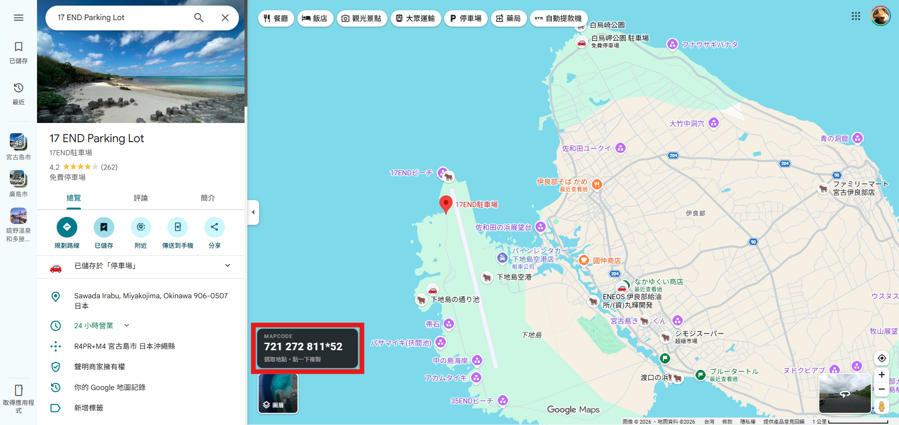
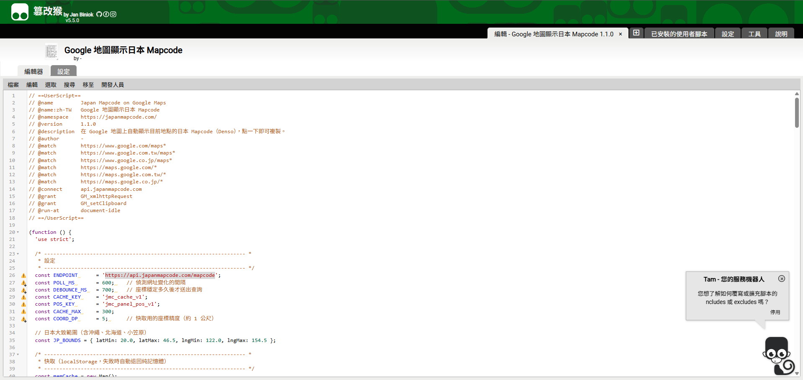

# Japan Mapcode on Google Maps

A Tampermonkey userscript that automatically shows the **Japan Mapcode** of the currently selected location on Google Maps, with one-click copy. Mapcode data is provided by [japanmapcode.com](https://japanmapcode.com/) (`https://api.japanmapcode.com/mapcode`). Perfect for planning Japan road trips — most Japanese car navigation systems accept a Mapcode as the destination.

在 Google 地圖上自動顯示目前地點的**日本 Mapcode**，點一下即可複製。Mapcode 資料由 [japanmapcode.com](https://japanmapcode.com/)（`https://api.japanmapcode.com/mapcode`）提供。適合規劃日本自駕行程 — 日本車用導航大多可直接輸入 Mapcode 設定目的地。

> **What is a Mapcode?** A short code (e.g. `721 272 810*43`) that identifies a precise location in Japan, widely used by Japanese car GPS/navigation systems.


*The floating Mapcode panel (bottom-left) showing the Mapcode of the selected place / 浮動面板（左下）顯示所選地點的 Mapcode*

## Features / 功能

- **Automatic lookup** — pick a place on Google Maps and its Mapcode appears in a floating panel; no extra clicks needed.
- **One-click copy** — click the panel to copy the Mapcode to your clipboard (the panel flashes green with「已複製 ✓」).
- **Draggable panel** — drag the panel anywhere on screen; its position is remembered across sessions.
- **Smart coordinate detection** — prefers the actually selected pin (`!3d…!4d…` in the URL), then `q=lat,lng` queries, then the map view center (`@lat,lng`).
- **Local cache** — the last 300 lookups are cached in `localStorage`, so revisiting a place is instant and saves API calls.
- **Japan-only** — outside Japan's bounds the panel simply shows「不在日本範圍」(outside Japan) instead of querying.

## Installation / 安裝

1. Install the [Tampermonkey](https://www.tampermonkey.net/) browser extension (Chrome / Edge / Firefox / Safari).
2. Open Tampermonkey → **Create a new script** (建立新腳本).
3. Delete the template content, paste the entire content of [`mapcode-on-google-map.js`](./mapcode-on-google-map.js), and save (`Ctrl+S`).

   
4. Open [Google Maps](https://www.google.com/maps). On first run, Tampermonkey may ask to allow a cross-origin request to `api.japanmapcode.com` — click **Always allow** (總是允許).

> On Chrome/Edge (Manifest V3) you may also need to enable **Developer mode** for extensions so Tampermonkey can run userscripts.

## Usage / 使用方式

1. Open Google Maps and navigate to a location in Japan.
2. Click a spot on the map (or search for a place). A dark floating panel appears near the bottom of the screen:

   ```
   MAPCODE
   721 272 810*43
   選取地點・點一下複製
   ```

3. **Click the panel** to copy the Mapcode to the clipboard.
4. **Drag the panel** to move it out of the way; the position is saved automatically.
5. Enter the copied Mapcode into a Japanese car navigation system's「マップコード」destination search.

### Panel states / 面板狀態

| Display | Meaning |
| --- | --- |
| `721 272 810*43` | Mapcode found — click to copy / 已取得，點一下複製 |
| `查詢中…` | Looking up the Mapcode / 查詢中 |
| `尚未選取地點` | No coordinates in the URL yet — click a spot on the map / 請先在地圖上點選位置 |
| `不在日本範圍` | The location is outside Japan / 位置不在日本 |
| `查詢失敗` | Lookup failed (network error, timeout, or unparseable response) / 查詢失敗 |

The second line shows the coordinate source: **選取地點** (selected pin), **座標查詢** (`q=lat,lng` query), or **畫面中心** (map view center).

## How it works / 運作原理

- The script polls the page URL every 600 ms and extracts coordinates from it (pin > query > view center).
- After the coordinates stay stable for 700 ms (debounce), it queries `https://api.japanmapcode.com/mapcode?lat=…&lng=…` via `GM_xmlhttpRequest`.
- Results are cached (up to 300 entries, ~1 m coordinate precision) in `localStorage` under `jmc_cache_v1`; the panel position is stored under `jmc_panel_pos_v1`.

### Supported Google Maps domains

`google.com/maps`, `google.com.tw/maps`, `google.co.jp/maps`, and the corresponding `maps.google.*` hosts. To support other regional domains, add extra `@match` lines in the script header.

## Notes & limitations / 注意事項

- Requires an internet connection to `api.japanmapcode.com` (a third-party service; availability is not guaranteed).
- When no pin is selected, the Mapcode is derived from the **map view center**, which changes as you pan — click an exact spot for a precise code.
- Mapcode accuracy depends on the API; always double-check the destination shown on your car navigation.
- The script only reads coordinates from the URL and sends them to the Mapcode API — no other data is collected or transmitted.

## Credits / 致謝

Mapcode lookups are powered by [japanmapcode.com](https://japanmapcode.com/) via `https://api.japanmapcode.com/mapcode`.
