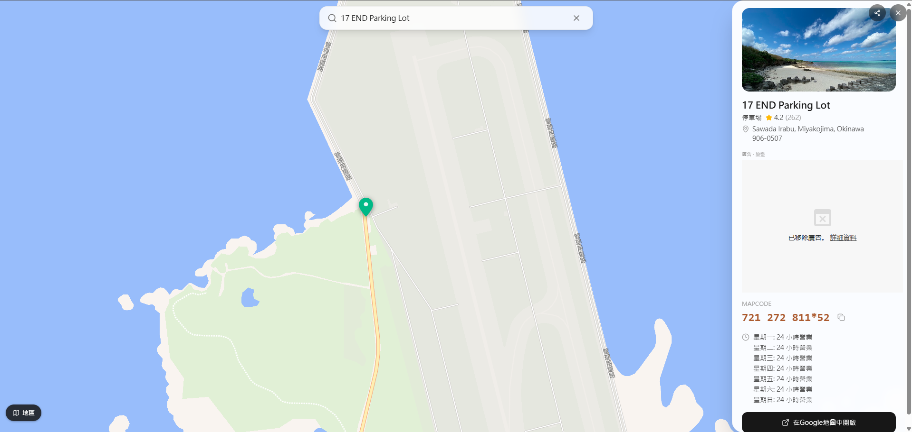
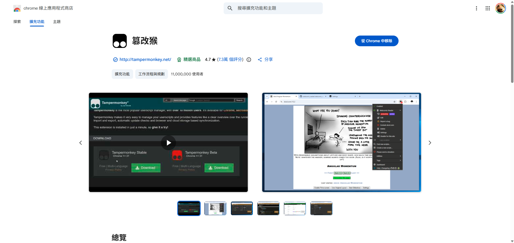
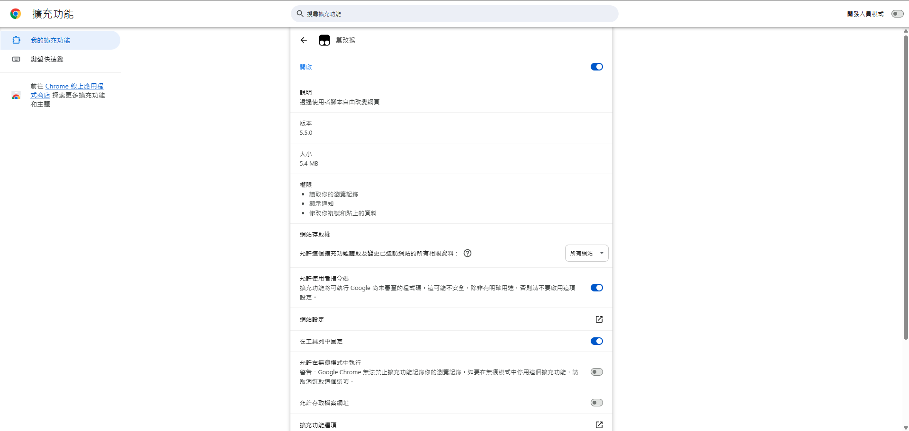
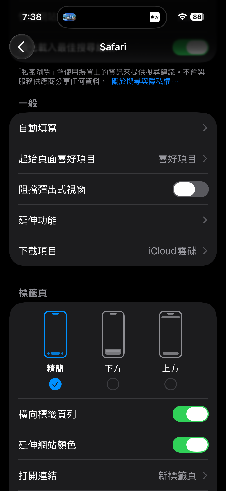
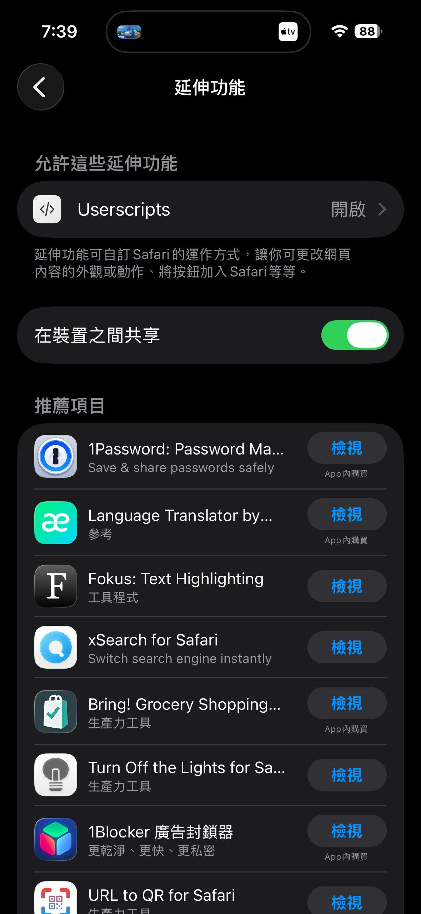
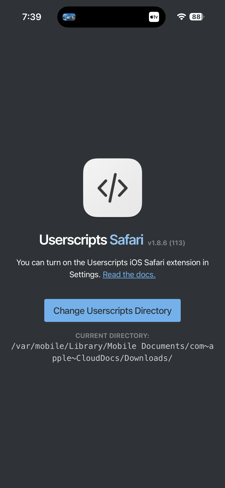
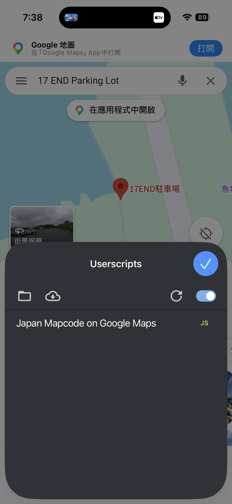
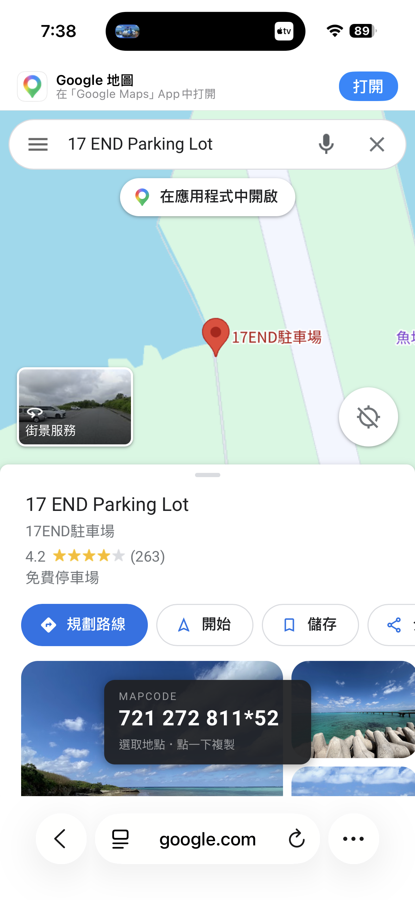

# Google 地圖顯示日本 Mapcode

一個 Tampermonkey 使用者腳本，會在 Google 地圖上自動顯示目前所選地點的**日本 Mapcode**，點一下即可複製。Mapcode 資料由 [japanmapcode.com](https://japanmapcode.com/)（`https://api.japanmapcode.com/mapcode`）提供。非常適合規劃日本自駕行程 — 日本車用導航大多可直接輸入 Mapcode 設定目的地。

> **什麼是 Mapcode？** 一組能精確指向日本某個位置的短碼（例如 `721 272 810*43`），廣泛用於日本車用 GPS／導航系統。

| 在 [japanmapcode.com](https://japanmapcode.com/) 上查詢 | 或用本腳本直接顯示在 Google 地圖上 |
| :---: | :---: |
|  |  |

*左：在官方 japanmapcode.com 網站查詢地點的 Mapcode。右：本腳本在 Google 地圖上自動以浮動面板（左下）顯示相同的 Mapcode。*

## 功能

- **自動查詢** — 在 Google 地圖上點選地點，其 Mapcode 就會顯示在浮動面板上，不需額外操作。
- **一鍵複製** — 點一下面板即可把 Mapcode 複製到剪貼簿（面板會閃綠並顯示「已複製 ✓」）。
- **可拖曳面板** — 面板可拖到畫面任意位置，位置會被記住並跨工作階段保留。
- **智慧座標偵測** — 優先使用實際選取的圖釘（網址中的 `!3d…!4d…`），其次是 `q=lat,lng` 查詢，最後才是畫面中心（`@lat,lng`）。
- **本機快取** — 最近 300 筆查詢會快取在 `localStorage`，再次造訪同一地點時即時顯示，也可減少 API 請求。
- **僅限日本** — 超出日本範圍時，面板只會顯示「不在日本範圍」而不會發出查詢。

## 安裝（電腦版 Chrome / Edge）

1. 安裝 [Tampermonkey](https://www.tampermonkey.net/) 瀏覽器擴充功能（Chrome / Edge / Firefox / Safari）。

   

2. 在 Chrome/Edge 上，開啟該擴充功能的詳細資料頁（`chrome://extensions` → Tampermonkey → **詳細資料**），開啟 **允許使用者指令碼**，Tampermonkey 才能執行使用者腳本。若是沒有這個選項的舊版 Chrome，改在擴充功能頁面開啟 **開發人員模式**。

   

3. 開啟 Tampermonkey → **建立新腳本**，刪除範本內容，貼上 [`mapcode-on-google-map.js`](./mapcode-on-google-map.js) 的完整內容，然後儲存（`Ctrl+S`）。

   

4. 開啟 [Google 地圖](https://www.google.com/maps)。首次執行時，Tampermonkey 可能會詢問是否允許對 `api.japanmapcode.com` 的跨來源請求，請點 **總是允許**。

## 安裝（iPhone / iPad，iOS Safari）

iOS 上不需要 Tampermonkey，改用免費的 **Userscripts** Safari 擴充功能即可。僅能在 **Safari** 上運作（iOS 版 Chrome 無法執行使用者腳本）。

1. 到 App Store 安裝免費的 [**Userscripts**](https://apps.apple.com/app/userscripts/id1463298887) App。

   

2. 前往 **設定 → Safari → 延伸功能**。

   

3. 開啟 **Userscripts**，並允許它存取所有網站。

   

4. 打開 **Userscripts** App，確認它的腳本資料夾（iCloud 雲碟／檔案 App 內的資料夾）；要自訂位置可點 **Change Userscripts Directory**。

   

5. 把腳本放進該資料夾：下載 [`mapcode-on-google-map.js`](./mapcode-on-google-map.js)，用 **檔案** App 把它移到步驟 4 的 Userscripts 資料夾。

6. 在 Safari 打開 [Google 地圖](https://www.google.com/maps)，點網址列的 **Userscripts** 按鈕（`aA`／擴充功能選單），確認 **Japan Mapcode on Google Maps** 已啟用。

   

7. 完成，Mapcode 面板會出現在地圖上，點一下即可複製。

   

## 使用方式

1. 打開 Google 地圖並移動到日本的某個地點。
2. 在地圖上點選一個位置（或搜尋地點）。畫面下方附近會出現一個深色浮動面板：

   ```
   MAPCODE
   721 272 810*43
   選取地點・點一下複製
   ```

3. **點一下面板**即可把 Mapcode 複製到剪貼簿。
4. **拖曳面板**可把它移到不擋路的位置，位置會自動儲存。
5. 把複製的 Mapcode 輸入日本車用導航的「マップコード」目的地搜尋。

### 面板狀態

| 顯示 | 意義 |
| --- | --- |
| `721 272 810*43` | 已取得 Mapcode — 點一下複製 |
| `查詢中…` | 正在查詢 Mapcode |
| `尚未選取地點` | 網址中還沒有座標 — 請先在地圖上點選位置 |
| `不在日本範圍` | 位置不在日本 |
| `查詢失敗` | 查詢失敗（連線錯誤、逾時，或回應無法解析） |

面板第二行會顯示座標來源：**選取地點**（選取的圖釘）、**座標查詢**（`q=lat,lng` 查詢），或 **畫面中心**（地圖畫面中心）。

## 運作原理

- 腳本每 600 毫秒偵測一次網址，並從中擷取座標（圖釘 > 查詢 > 畫面中心）。
- 座標穩定 700 毫秒（去抖動）後，透過 `GM_xmlhttpRequest` 向 `https://api.japanmapcode.com/mapcode?lat=…&lng=…` 發出查詢。
- 查詢結果會快取（最多 300 筆，座標精度約 1 公尺）在 `localStorage` 的 `jmc_cache_v1`；面板位置則存在 `jmc_panel_pos_v1`。

### 支援的 Google 地圖網域

`google.com/maps`、`google.com.tw/maps`、`google.co.jp/maps`，以及對應的 `maps.google.*` 主機。若要支援其他地區的網域，在腳本標頭中新增 `@match` 行即可。

## 注意事項

- 需要能連線到 `api.japanmapcode.com`（第三方服務，不保證可用性）。
- 未選取圖釘時，Mapcode 是依 **畫面中心** 推算的，會隨著地圖平移而改變 — 想要精確的碼請點選確切位置。
- Mapcode 的準確度取決於該 API；請務必再次核對車用導航上顯示的目的地。
- 腳本只從網址讀取座標並送往 Mapcode API，不會蒐集或傳送其他資料。

## 致謝

Mapcode 查詢由 [japanmapcode.com](https://japanmapcode.com/) 透過 `https://api.japanmapcode.com/mapcode` 提供。
